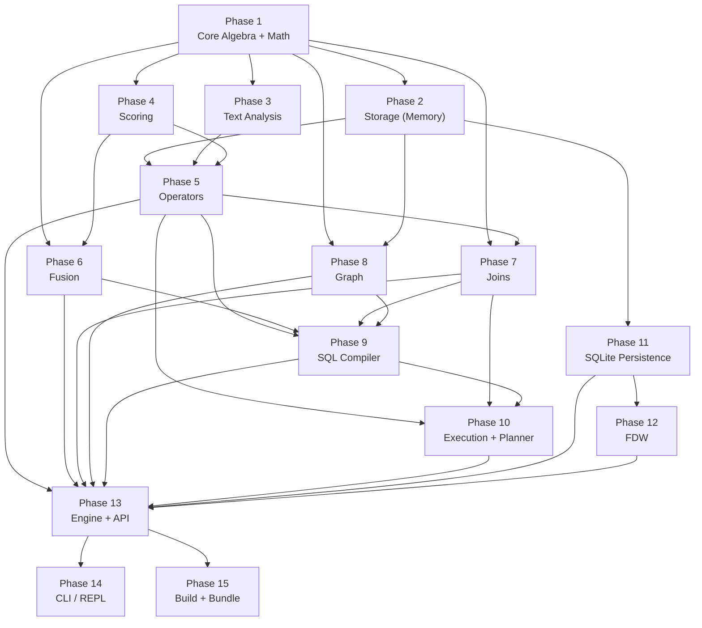

# UQA TypeScript Porting Plan

Complete 1:1 port of Python UQA to TypeScript for browser execution.

## Source Overview

| Item | Value |
|------|-------|
| Python source files | 108 (excluding tests, `__init__.py`) |
| Python source lines | ~44,600 |
| Python test files | ~150 |
| Papers | 5 (docs/papers/) |

## Dependency Mapping

Every Python dependency maps to a browser-compatible TypeScript equivalent.

| Python | Role | TypeScript Replacement |
|--------|------|----------------------|
| numpy | Vector/matrix math | `Float64Array` + `src/math/linalg.ts` |
| pglast | SQL parser (PG 17) | `libpg-query` (WASM, same AST as pglast) |
| pyarrow | Arrow columnar format | `apache-arrow` (official JS) |
| duckdb | Embedded analytics DB | `@duckdb/duckdb-wasm` |
| bayesian-bm25 | Probabilistic scoring/fusion | `bayesian-bm25` (npm, TypeScript port) |
| sqlite3 | Persistence | `sql.js` (Emscripten WASM SQLite) |
| prompt-toolkit | Terminal REPL | `xterm` (web terminal) |
| pygments | Syntax highlighting | `highlight.js` |
| threading | Parallel execution | Web Workers + `comlink` |

### `libpg-query` -- SQL Parser

WASM build of `libpg_query`, the same C library that pglast wraps.
Produces identical AST node names (`SelectStmt`, `JoinExpr`, `ColumnRef`,
`A_Expr`, etc.), so `sql/compiler.py`'s AST-walking logic ports directly.

- WASM binary: 1.1 MB (~400 KB gzipped)
- PostgreSQL 13-17 support
- 129K weekly downloads, actively maintained
- Browser-ready, no native dependencies

### `bayesian-bm25` -- Probabilistic Scoring

TypeScript port of the Python `bayesian-bm25` package. Provides:

- `BayesianProbabilityTransform`, `TemporalBayesianTransform`
- `BayesianBM25Scorer`, `BM25`, `MultiFieldScorer`
- `VectorProbabilityTransform`, `PlattCalibrator`, `IsotonicCalibrator`
- `sigmoid`, `logit`, `probNot`, `probAnd`, `probOr`
- `logOddsConjunction`, `balancedLogOddsFusion`
- `BlockMaxIndex`, density estimation utilities

Zero runtime dependencies, ESM-only, browser-compatible.

---

## Project Structure

```
uqa-js/
  package.json
  tsconfig.json
  vitest.config.ts
  vite.config.ts
  src/
    index.ts
    math/
      linalg.ts
      random.ts
    core/
      types.ts
      posting-list.ts
      hierarchical.ts
      functor.ts
    operators/
      base.ts
      primitive.ts
      boolean.ts
      aggregation.ts
      multi-field.ts
      hybrid.ts
      calibrated-vector.ts
      hierarchical.ts
      sparse.ts
      multi-stage.ts
      deep-fusion.ts
      deep-learn.ts
      attention.ts
      learned-fusion.ts
      progressive-fusion.ts
      backend.ts
    storage/
      abc/
        document-store.ts
        inverted-index.ts
        graph-store.ts
      document-store.ts
      inverted-index.ts
      vector-index.ts
      spatial-index.ts
      block-max-index.ts
      index-abc.ts
      index-types.ts
      btree-index.ts
      index-manager.ts
      ivf-index.ts
      catalog.ts
      managed-connection.ts
      sqlite-document-store.ts
      sqlite-inverted-index.ts
      sqlite-graph-store.ts
      transaction.ts
    scoring/
      bm25.ts
      bayesian-bm25.ts
      calibration.ts
      multi-field.ts
      vector.ts
      wand.ts
      fusion-wand.ts
      parameter-learner.ts
      external-prior.ts
    analysis/
      analyzer.ts
      tokenizer.ts
      token-filter.ts
      char-filter.ts
    fusion/
      boolean.ts
      log-odds.ts
      attention.ts
      learned.ts
      query-features.ts
    graph/
      store.ts
      posting-list.ts
      operators.ts
      pattern.ts
      rpq-optimizer.ts
      index.ts
      centrality.ts
      message-passing.ts
      join.ts
      cross-paradigm.ts
      temporal-traverse.ts
      temporal-filter.ts
      temporal-pattern-match.ts
      delta.ts
      incremental-match.ts
      versioned-store.ts
      graph-embedding.ts
      cypher/
        ast.ts
        lexer.ts
        parser.ts
        compiler.ts
    joins/
      base.ts
      inner.ts
      outer.ts
      semi.ts
      sort-merge.ts
      index.ts
      cross.ts
      cross-paradigm.ts
    sql/
      compiler.ts
      expr-evaluator.ts
      fts-query.ts
      table.ts
    planner/
      optimizer.ts
      cost-model.ts
      cardinality.ts
      join-order.ts
      join-enumerator.ts
      join-graph.ts
      executor.ts
      parallel.ts
    execution/
      physical.ts
      relational.ts
      scan.ts
      batch.ts
      spill.ts
    fdw/
      handler.ts
      foreign-table.ts
      arrow-handler.ts
      duckdb-handler.ts
    api/
      query-builder.ts
    cli/
      repl.ts
    engine.ts
  tests/
    (mirrors src/ structure with *.test.ts files)
```

---

## Complete File Mapping

### math/ (new -- replaces numpy)

| TypeScript | Est. Lines | Notes |
|-----------|----------:|-------|
| `src/math/linalg.ts` | 400 | Float64Array vector/matrix ops: dot, norm, cosine, matmul, exp, softmax, argmax, argsort, zeros, ones |
| `src/math/random.ts` | 100 | Seedable PRNG with Box-Muller for normal distribution |

### core/

| Python | Lines | TypeScript |
|--------|------:|-----------|
| `core/types.py` | 244 | `src/core/types.ts` |
| `core/posting_list.py` | 312 | `src/core/posting-list.ts` |
| `core/hierarchical.py` | 71 | `src/core/hierarchical.ts` |
| `core/functor.py` | 175 | `src/core/functor.ts` |

### operators/

| Python | Lines | TypeScript |
|--------|------:|-----------|
| `operators/base.py` | 72 | `src/operators/base.ts` |
| `operators/primitive.py` | 479 | `src/operators/primitive.ts` |
| `operators/boolean.py` | 84 | `src/operators/boolean.ts` |
| `operators/aggregation.py` | 239 | `src/operators/aggregation.ts` |
| `operators/multi_field.py` | 89 | `src/operators/multi-field.ts` |
| `operators/hybrid.py` | 474 | `src/operators/hybrid.ts` |
| `operators/calibrated_vector.py` | 274 | `src/operators/calibrated-vector.ts` |
| `operators/hierarchical.py` | 254 | `src/operators/hierarchical.ts` |
| `operators/sparse.py` | 51 | `src/operators/sparse.ts` |
| `operators/multi_stage.py` | 103 | `src/operators/multi-stage.ts` |
| `operators/deep_fusion.py` | 1154 | `src/operators/deep-fusion.ts` |
| `operators/deep_learn.py` | 1104 | `src/operators/deep-learn.ts` |
| `operators/attention.py` | 70 | `src/operators/attention.ts` |
| `operators/learned_fusion.py` | 65 | `src/operators/learned-fusion.ts` |
| `operators/progressive_fusion.py` | 98 | `src/operators/progressive-fusion.ts` |
| `operators/_backend.py` | 922 | `src/operators/backend.ts` |

### storage/

| Python | Lines | TypeScript |
|--------|------:|-----------|
| `storage/abc/document_store.py` | 80 | `src/storage/abc/document-store.ts` |
| `storage/abc/inverted_index.py` | 159 | `src/storage/abc/inverted-index.ts` |
| `storage/abc/graph_store.py` | 171 | `src/storage/abc/graph-store.ts` |
| `storage/document_store.py` | 71 | `src/storage/document-store.ts` |
| `storage/inverted_index.py` | 332 | `src/storage/inverted-index.ts` |
| `storage/vector_index.py` | 63 | `src/storage/vector-index.ts` |
| `storage/spatial_index.py` | 181 | `src/storage/spatial-index.ts` |
| `storage/block_max_index.py` | 172 | `src/storage/block-max-index.ts` |
| `storage/index_abc.py` | 55 | `src/storage/index-abc.ts` |
| `storage/index_types.py` | 33 | `src/storage/index-types.ts` |
| `storage/btree_index.py` | 110 | `src/storage/btree-index.ts` |
| `storage/index_manager.py` | 125 | `src/storage/index-manager.ts` |
| `storage/ivf_index.py` | 669 | `src/storage/ivf-index.ts` |
| `storage/catalog.py` | 842 | `src/storage/catalog.ts` |
| `storage/managed_connection.py` | 198 | `src/storage/managed-connection.ts` |
| `storage/sqlite_document_store.py` | 277 | `src/storage/sqlite-document-store.ts` |
| `storage/sqlite_inverted_index.py` | 770 | `src/storage/sqlite-inverted-index.ts` |
| `storage/sqlite_graph_store.py` | 335 | `src/storage/sqlite-graph-store.ts` |
| `storage/transaction.py` | 94 | `src/storage/transaction.ts` |

### scoring/

| Python | Lines | TypeScript | Notes |
|--------|------:|-----------|-------|
| `scoring/bm25.py` | 75 | `src/scoring/bm25.ts` | Delegate to `bayesian-bm25` `BM25` class |
| `scoring/bayesian_bm25.py` | 83 | `src/scoring/bayesian-bm25.ts` | Delegate to `bayesian-bm25` `BayesianBM25Scorer` |
| `scoring/calibration.py` | 95 | `src/scoring/calibration.ts` | Delegate to `bayesian-bm25` `VectorProbabilityTransform` |
| `scoring/multi_field.py` | 80 | `src/scoring/multi-field.ts` | Delegate to `bayesian-bm25` `MultiFieldScorer` |
| `scoring/vector.py` | 70 | `src/scoring/vector.ts` | Cosine, dot, euclidean via `src/math/linalg.ts` |
| `scoring/wand.py` | 434 | `src/scoring/wand.ts` | Delegate to `bayesian-bm25` `BlockMaxIndex` where applicable |
| `scoring/fusion_wand.py` | 184 | `src/scoring/fusion-wand.ts` | |
| `scoring/parameter_learner.py` | 82 | `src/scoring/parameter-learner.ts` | |
| `scoring/external_prior.py` | 138 | `src/scoring/external-prior.ts` | |

### analysis/

| Python | Lines | TypeScript |
|--------|------:|-----------|
| `analysis/analyzer.py` | 200 | `src/analysis/analyzer.ts` |
| `analysis/tokenizer.py` | 167 | `src/analysis/tokenizer.ts` |
| `analysis/token_filter.py` | 655 | `src/analysis/token-filter.ts` |
| `analysis/char_filter.py` | 120 | `src/analysis/char-filter.ts` |

### fusion/

| Python | Lines | TypeScript | Notes |
|--------|------:|-----------|-------|
| `fusion/boolean.py` | 40 | `src/fusion/boolean.ts` | Delegate to `bayesian-bm25` `probAnd`/`probOr`/`probNot` |
| `fusion/log_odds.py` | 157 | `src/fusion/log-odds.ts` | Delegate to `bayesian-bm25` `logOddsConjunction` |
| `fusion/attention.py` | 172 | `src/fusion/attention.ts` | Delegate to `bayesian-bm25` attention weights |
| `fusion/learned.py` | 62 | `src/fusion/learned.ts` | Delegate to `bayesian-bm25` `LearnableLogOddsWeights` |
| `fusion/query_features.py` | 64 | `src/fusion/query-features.ts` | |

### graph/

| Python | Lines | TypeScript |
|--------|------:|-----------|
| `graph/store.py` | 479 | `src/graph/store.ts` |
| `graph/posting_list.py` | 98 | `src/graph/posting-list.ts` |
| `graph/operators.py` | 1037 | `src/graph/operators.ts` |
| `graph/pattern.py` | 226 | `src/graph/pattern.ts` |
| `graph/rpq_optimizer.py` | 155 | `src/graph/rpq-optimizer.ts` |
| `graph/index.py` | 350 | `src/graph/index.ts` |
| `graph/centrality.py` | 349 | `src/graph/centrality.ts` |
| `graph/message_passing.py` | 113 | `src/graph/message-passing.ts` |
| `graph/join.py` | 161 | `src/graph/join.ts` |
| `graph/cross_paradigm.py` | 351 | `src/graph/cross-paradigm.ts` |
| `graph/temporal_traverse.py` | 100 | `src/graph/temporal-traverse.ts` |
| `graph/temporal_filter.py` | 54 | `src/graph/temporal-filter.ts` |
| `graph/temporal_pattern_match.py` | 194 | `src/graph/temporal-pattern-match.ts` |
| `graph/delta.py` | 81 | `src/graph/delta.ts` |
| `graph/incremental_match.py` | 118 | `src/graph/incremental-match.ts` |
| `graph/versioned_store.py` | 110 | `src/graph/versioned-store.ts` |
| `graph/graph_embedding.py` | 154 | `src/graph/graph-embedding.ts` |
| `graph/cypher/ast.py` | 302 | `src/graph/cypher/ast.ts` |
| `graph/cypher/lexer.py` | 317 | `src/graph/cypher/lexer.ts` |
| `graph/cypher/parser.py` | 806 | `src/graph/cypher/parser.ts` |
| `graph/cypher/compiler.py` | 1544 | `src/graph/cypher/compiler.ts` |

### joins/

| Python | Lines | TypeScript |
|--------|------:|-----------|
| `joins/base.py` | 39 | `src/joins/base.ts` |
| `joins/inner.py` | 95 | `src/joins/inner.ts` |
| `joins/outer.py` | 203 | `src/joins/outer.ts` |
| `joins/semi.py` | 117 | `src/joins/semi.ts` |
| `joins/sort_merge.py` | 109 | `src/joins/sort-merge.ts` |
| `joins/index.py` | 90 | `src/joins/index.ts` |
| `joins/cross.py` | 60 | `src/joins/cross.ts` |
| `joins/cross_paradigm.py` | 360 | `src/joins/cross-paradigm.ts` |

### sql/

| Python | Lines | TypeScript | Notes |
|--------|------:|-----------|-------|
| `sql/compiler.py` | 9836 | `src/sql/compiler.ts` | Walk `libpg-query` AST (identical to pglast) |
| `sql/expr_evaluator.py` | 2283 | `src/sql/expr-evaluator.ts` | |
| `sql/fts_query.py` | 510 | `src/sql/fts-query.ts` | |
| `sql/table.py` | 566 | `src/sql/table.ts` | |

### planner/

| Python | Lines | TypeScript |
|--------|------:|-----------|
| `planner/optimizer.py` | 881 | `src/planner/optimizer.ts` |
| `planner/cost_model.py` | 252 | `src/planner/cost-model.ts` |
| `planner/cardinality.py` | 1021 | `src/planner/cardinality.ts` |
| `planner/join_order.py` | 174 | `src/planner/join-order.ts` |
| `planner/join_enumerator.py` | 493 | `src/planner/join-enumerator.ts` |
| `planner/join_graph.py` | 176 | `src/planner/join-graph.ts` |
| `planner/executor.py` | 314 | `src/planner/executor.ts` |
| `planner/parallel.py` | 89 | `src/planner/parallel.ts` |

### execution/

| Python | Lines | TypeScript |
|--------|------:|-----------|
| `execution/physical.py` | 43 | `src/execution/physical.ts` |
| `execution/relational.py` | 1826 | `src/execution/relational.ts` |
| `execution/scan.py` | 158 | `src/execution/scan.ts` |
| `execution/batch.py` | 354 | `src/execution/batch.ts` |
| `execution/spill.py` | 185 | `src/execution/spill.ts` |

### fdw/

| Python | Lines | TypeScript |
|--------|------:|-----------|
| `fdw/handler.py` | 59 | `src/fdw/handler.ts` |
| `fdw/foreign_table.py` | 88 | `src/fdw/foreign-table.ts` |
| `fdw/arrow_handler.py` | 147 | `src/fdw/arrow-handler.ts` |
| `fdw/duckdb_handler.py` | 169 | `src/fdw/duckdb-handler.ts` |

### api/

| Python | Lines | TypeScript |
|--------|------:|-----------|
| `api/query_builder.py` | 833 | `src/api/query-builder.ts` |

### cli/

| Python | Lines | TypeScript |
|--------|------:|-----------|
| `cli.py` | 826 | `src/cli/repl.ts` |

### engine

| Python | Lines | TypeScript |
|--------|------:|-----------|
| `engine.py` | 992 | `src/engine.ts` |

---

## Phased Implementation

### Phase 1: Project Scaffold + Core Algebra

**Goal:** PostingList Boolean algebra with all five axioms tested.

**Deliverables:**
- Project config: `package.json`, `tsconfig.json`, `vitest.config.ts`, ESLint, Prettier
- `src/math/linalg.ts` -- Float64Array vector/matrix operations
- `src/math/random.ts` -- Seedable PRNG
- `src/core/types.ts` -- DocId, Payload, PostingEntry, Vertex, Edge, Predicate, IndexStats
- `src/core/posting-list.ts` -- PostingList, GeneralizedPostingList
- Tests proving all five Boolean algebra axioms

**Key type decisions:**

```typescript
type DocId = number;
type FieldName = string;
type TermValue = string;
type PathExpr = ReadonlyArray<string | number>;

interface Payload {
  readonly positions: ReadonlyArray<number>;
  readonly score: number;
  readonly fields: Readonly<Record<FieldName, unknown>>;
}

interface PostingEntry {
  readonly docId: DocId;
  readonly payload: Payload;
}
```

---

### Phase 2: Storage Layer (Memory)

**Goal:** All abstract interfaces + all memory implementations.

**Deliverables:**
- `src/storage/abc/document-store.ts`
- `src/storage/abc/inverted-index.ts`
- `src/storage/abc/graph-store.ts`
- `src/storage/document-store.ts`
- `src/storage/inverted-index.ts`
- `src/storage/vector-index.ts`
- `src/storage/spatial-index.ts`
- `src/storage/block-max-index.ts`
- `src/storage/index-abc.ts`
- `src/storage/index-types.ts`
- `src/storage/btree-index.ts`
- `src/storage/index-manager.ts`
- `src/storage/ivf-index.ts`

---

### Phase 3: Text Analysis

**Goal:** Full text analysis pipeline.

**Deliverables:**
- `src/analysis/tokenizer.ts` -- all 6 tokenizers
- `src/analysis/token-filter.ts` -- all 8 filters including PorterStem
- `src/analysis/char-filter.ts`
- `src/analysis/analyzer.ts`

---

### Phase 4: Scoring

**Goal:** All scoring modules, delegating to `bayesian-bm25` where possible.

**Deliverables:**
- `src/scoring/bm25.ts`
- `src/scoring/bayesian-bm25.ts`
- `src/scoring/calibration.ts`
- `src/scoring/multi-field.ts`
- `src/scoring/vector.ts`
- `src/scoring/wand.ts`
- `src/scoring/fusion-wand.ts`
- `src/scoring/parameter-learner.ts`
- `src/scoring/external-prior.ts`

---

### Phase 5: Operators

**Goal:** All operator implementations.

**Deliverables:**
- `src/operators/base.ts`
- `src/operators/primitive.ts`
- `src/operators/boolean.ts`
- `src/operators/aggregation.ts`
- `src/operators/multi-field.ts`
- `src/operators/hybrid.ts`
- `src/operators/calibrated-vector.ts`
- `src/operators/hierarchical.ts`
- `src/operators/sparse.ts`
- `src/operators/multi-stage.ts`
- `src/operators/deep-fusion.ts`
- `src/operators/deep-learn.ts`
- `src/operators/attention.ts`
- `src/operators/learned-fusion.ts`
- `src/operators/progressive-fusion.ts`
- `src/operators/backend.ts`

---

### Phase 6: Fusion

**Goal:** All fusion implementations, delegating to `bayesian-bm25`.

**Deliverables:**
- `src/fusion/boolean.ts`
- `src/fusion/log-odds.ts`
- `src/fusion/attention.ts`
- `src/fusion/learned.ts`
- `src/fusion/query-features.ts`

---

### Phase 7: Joins

**Goal:** All join operators.

**Deliverables:**
- `src/joins/base.ts`
- `src/joins/inner.ts`
- `src/joins/outer.ts`
- `src/joins/semi.ts`
- `src/joins/sort-merge.ts`
- `src/joins/index.ts`
- `src/joins/cross.ts`
- `src/joins/cross-paradigm.ts`

---

### Phase 8: Graph Subsystem

**Goal:** Complete graph support including Cypher.

**Deliverables:**
- `src/graph/store.ts`
- `src/graph/posting-list.ts`
- `src/graph/operators.ts`
- `src/graph/pattern.ts`
- `src/graph/rpq-optimizer.ts`
- `src/graph/index.ts`
- `src/graph/centrality.ts`
- `src/graph/message-passing.ts`
- `src/graph/join.ts`
- `src/graph/cross-paradigm.ts`
- `src/graph/temporal-traverse.ts`
- `src/graph/temporal-filter.ts`
- `src/graph/temporal-pattern-match.ts`
- `src/graph/delta.ts`
- `src/graph/incremental-match.ts`
- `src/graph/versioned-store.ts`
- `src/graph/graph-embedding.ts`
- `src/graph/cypher/ast.ts`
- `src/graph/cypher/lexer.ts`
- `src/graph/cypher/parser.ts`
- `src/graph/cypher/compiler.ts`

---

### Phase 9: SQL Compiler

**Goal:** Complete SQL support using `libpg-query` WASM parser.

`libpg-query` produces the same AST as pglast (both wrap libpg_query C library).
The compiler walks this AST to produce UQA operators -- same logic as Python.

**Deliverables:**
- `src/sql/compiler.ts`
- `src/sql/expr-evaluator.ts`
- `src/sql/fts-query.ts`
- `src/sql/table.ts`

**Supported SQL (complete parity with Python):**

```
DDL:  CREATE [TEMPORARY] TABLE, DROP TABLE [IF EXISTS],
      CREATE VIEW, CREATE/ALTER SEQUENCE
DML:  INSERT INTO ... VALUES, UPDATE ... SET, DELETE FROM
DQL:  SELECT [DISTINCT] ... FROM ... [JOIN ...]
      [WHERE ...] [GROUP BY ...] [HAVING ...]
      [ORDER BY ...] [LIMIT ...] [OFFSET ...]
      WITH (CTEs incl. recursive), subqueries, window functions
TXN:  BEGIN, COMMIT, ROLLBACK, SAVEPOINT
```

**All UQA SQL extensions:**

```
text_match, bayesian_match, knn_match, bayesian_knn_match,
traverse_match, path_filter, multi_field_match,
fuse_log_odds, fuse_prob_and, fuse_prob_or, fuse_prob_not,
fuse_attention, sparse_threshold, path_agg, path_value
```

---

### Phase 10: Execution + Planner

**Goal:** Physical execution, relational operators, query optimization.

**Deliverables:**
- `src/execution/physical.ts`
- `src/execution/relational.ts`
- `src/execution/scan.ts`
- `src/execution/batch.ts`
- `src/execution/spill.ts` -- IndexedDB-backed spill
- `src/planner/optimizer.ts`
- `src/planner/cost-model.ts`
- `src/planner/cardinality.ts`
- `src/planner/join-order.ts`
- `src/planner/join-enumerator.ts`
- `src/planner/join-graph.ts`
- `src/planner/executor.ts`
- `src/planner/parallel.ts` -- Web Workers via Comlink

---

### Phase 11: SQLite Persistence (WASM)

**Goal:** SQLite-backed storage using sql.js (Emscripten SQLite WASM).

**Deliverables:**
- `src/storage/managed-connection.ts`
- `src/storage/catalog.ts`
- `src/storage/sqlite-document-store.ts`
- `src/storage/sqlite-inverted-index.ts`
- `src/storage/sqlite-graph-store.ts`
- `src/storage/transaction.ts`

sql.js provides synchronous in-memory SQLite compiled to WASM.
Persistence to IndexedDB via `db.export()` -> `IDBObjectStore.put()`.

---

### Phase 12: Foreign Data Wrappers

**Goal:** Arrow and DuckDB FDW for browser.

**Deliverables:**
- `src/fdw/handler.ts`
- `src/fdw/foreign-table.ts`
- `src/fdw/arrow-handler.ts` -- via `apache-arrow` JS
- `src/fdw/duckdb-handler.ts` -- via `@duckdb/duckdb-wasm`

---

### Phase 13: Query Builder + Engine + Hierarchical + Functors

**Goal:** Fluent API, top-level Engine, full integration.

**Deliverables:**
- `src/core/hierarchical.ts`
- `src/core/functor.ts`
- `src/api/query-builder.ts`
- `src/engine.ts`
- `src/index.ts`
- Full integration test suite

---

### Phase 14: CLI / REPL

**Goal:** Browser-based REPL.

**Deliverables:**
- `src/cli/repl.ts` -- Web terminal via xterm.js, SQL highlighting via highlight.js

---

### Phase 15: Build + Bundle

**Goal:** Browser-ready ESM + UMD bundle.

**Tooling:**
- Bundler: Vite (library mode)
- Outputs: `dist/uqa.es.js`, `dist/uqa.umd.js`, `dist/index.d.ts`
- Tree-shakable, source maps

**package.json:**

```json
{
  "name": "uqa",
  "version": "0.1.0",
  "type": "module",
  "main": "dist/uqa.umd.js",
  "module": "dist/uqa.es.js",
  "types": "dist/index.d.ts",
  "exports": {
    ".": {
      "import": "./dist/uqa.es.js",
      "require": "./dist/uqa.umd.js",
      "types": "./dist/index.d.ts"
    }
  },
  "dependencies": {
    "bayesian-bm25": "^0.8.0",
    "libpg-query": "^17.7.0",
    "apache-arrow": "^18.0.0",
    "@duckdb/duckdb-wasm": "^1.29.0",
    "sql.js": "^1.11.0",
    "xterm": "^5.5.0",
    "highlight.js": "^11.10.0",
    "comlink": "^4.4.0"
  },
  "devDependencies": {
    "typescript": "^5.7.0",
    "vitest": "^3.0.0",
    "vite": "^6.0.0",
    "eslint": "^9.0.0",
    "@typescript-eslint/eslint-plugin": "^8.0.0",
    "prettier": "^3.4.0"
  }
}
```

---

## Phase Dependency Graph



**Parallel opportunities:**
- Phases 2, 3, 4 run in parallel after Phase 1
- Phases 6, 7, 8 run in parallel after Phase 5
- Phase 11 runs in parallel with Phases 5-10

---

## numpy Replacement Strategy

All numpy operations are replaced by `src/math/linalg.ts` using `Float64Array`.

| Category | Python | TypeScript |
|----------|--------|-----------|
| 1D vector | `np.array([...])` | `new Float64Array([...])` |
| Dot product | `np.dot(a, b)` | `dot(a, b)` |
| Norm | `np.linalg.norm(v)` | `norm(v)` |
| Cosine | manual | `cosine(a, b)` |
| 2D matrix | `np.array([[...]])` | `Float64Array` + `[rows, cols]` shape |
| Matmul | `a @ b` | `matmul(a, shapeA, b, shapeB)` |
| Element-wise | `a * b`, `np.exp(a)` | `mul(a, b)`, `exp(a)` |
| Random | `np.random.randn(n)` | `randn(n)` Box-Muller |
| Argmax | `np.argmax(a)` | `argmax(a)` |
| Argsort | `np.argsort(a)` | `argsort(a)` |
| Zeros | `np.zeros(n)` | `new Float64Array(n)` |
| Ones | `np.ones(n)` | `ones(n)` |
| Softmax | `scipy.special.softmax` | `softmax(a)` |
| Sigmoid | manual | `sigmoid(x)` |
| Clip | `np.clip(a, lo, hi)` | `clip(a, lo, hi)` |

---

## Critical Algorithms (Must Preserve Numerical Equivalence)

1. **Two-pointer posting list merge** -- union, intersect (O(n+m))
2. **BM25 numerically stable formula** -- `w - w / (1 + f * invNorm)`
3. **Bayesian three-term log-odds decomposition** -- Theorem 4.4.2
4. **Log-odds conjunction with scale neutrality** -- Theorem 4.2
5. **Vector calibration likelihood ratio** -- Paper 5
6. **WAND pruning with Bayesian upper bounds**
7. **Graph-PostingList isomorphism** -- Theorem 1.1.6, Paper 2
8. **Subgraph pattern matching** -- backtracking + arc consistency + MRV
9. **RPQ subset construction with WAND pruning**
10. **Porter stemming algorithm**
11. **IVF+HNSW vector indexing**
12. **Deep fusion forward/backward pass** -- matrix ops via Float64Array
13. **CNN convolution, pooling, dense, attention layers**
14. **PageRank, betweenness centrality, closeness centrality**
15. **DPccp join enumeration**

---

## TypeScript Conventions

| Concern | Convention |
|---------|-----------|
| Naming | `camelCase` methods/properties, `PascalCase` types/classes |
| Immutability | `readonly` on all data types (Payload, PostingEntry, Vertex, Edge) |
| Nullability | Strict null checks. `T \| null` instead of `Optional[T]` |
| Collections | `Map<K,V>` and `Set<T>` where key type matters |
| Iteration | Generator functions (`function*`) for lazy sequences |
| Errors | Typed error classes extending `Error` |
| Enums | String literal unions instead of `enum` |
| Module format | ESM (`import`/`export`) |
| Test framework | Vitest |
| Linter | ESLint with @typescript-eslint |
| Formatter | Prettier |

---

## Estimated Totals

| Category | Files | Lines (est.) |
|----------|------:|------------:|
| Source (ported 1:1) | 108 | ~38,000 |
| Source (new: math module) | 2 | ~500 |
| Tests | ~50 | ~15,000 |
| Config | ~5 | ~150 |
| **Total** | **~165** | **~53,650** |
