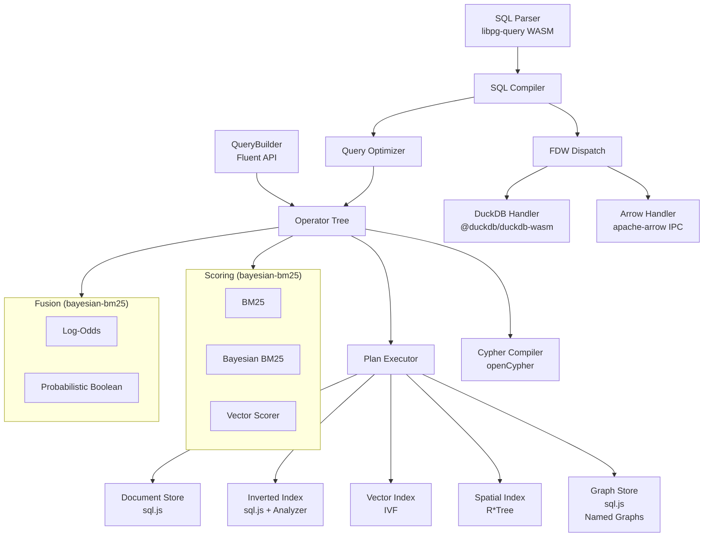

# UQA-JS — Unified Query Algebra for the Browser

A multi-paradigm database engine that unifies **relational**, **text retrieval**, **vector search**, **graph query**, and **geospatial** paradigms under a single algebraic structure, using posting lists as the universal abstraction. SQL interface targets **PostgreSQL 17** compatibility.

> **Note:** UQA-JS is the TypeScript/browser port of [UQA](https://github.com/cognica-io/uqa) (Python). The unified query algebra theory behind this project is deployed in production as [Cognica Database](https://cognica.io), a commercial multi-paradigm database engine built in C++20/23. UQA-JS brings the full algebraic framework to the browser via WebAssembly-based dependencies, with identical semantics to the Python reference implementation.

## Background

Modern data systems are fragmented into specialized engines: relational databases built on relational algebra, search engines on probabilistic IR models, vector databases on geometric similarity, and graph databases on traversal semantics. UQA eliminates this fragmentation by proving that a single algebraic structure can express operations across all four paradigms.

### Posting Lists as Universal Abstraction

The core insight is that **posting lists** — sorted sequences of `(document_id, payload)` pairs — can represent result sets from any paradigm. A posting list $L$ is defined as:

$$
L = [(id_1, payload_1),\ (id_2, payload_2),\ \ldots,\ (id_n, payload_n)]
$$

where $id_i < id_j$ for all $i < j$. A bijection $PL: 2^{\mathcal{D}} \rightarrow \mathcal{L}$ maps document sets to posting lists and back, allowing set-theoretic reasoning to carry over directly.

### Boolean Algebra

The structure $(\mathcal{L},\ \cup,\ \cap,\ \overline{\cdot},\ \emptyset,\ \mathcal{D})$ forms a **complete Boolean algebra** — satisfying commutativity, associativity, distributivity, identity, and complement laws. This means any combination of AND, OR, and NOT across paradigms is algebraically well-defined, and query optimization can exploit lattice-theoretic rewrite rules.

### Cross-Paradigm Operators

Primitive operators map each paradigm into the posting list space:

| Operator | Definition | Paradigm |
|----------|-----------|----------|
| $T(t)$ | $PL(\lbrace d \in \mathcal{D} \mid t \in term(d, f) \rbrace)$ | Text retrieval |
| $V_\theta(q)$ | $PL(\lbrace d \in \mathcal{D} \mid sim(vec(d, f),\ q) \geq \theta \rbrace)$ | Vector search |
| $KNN_k(q)$ | $PL(D_k)$ where $\|D_k\| = k$, ranked by similarity | Vector search |
| $Filter_{f,v}(L)$ | $L \cap PL(\lbrace d \in \mathcal{D} \mid d.f = v \rbrace)$ | Relational |
| $Score_q(L)$ | $(L,\ [s_1, \ldots, s_{\|L\|}])$ | Scoring |

Because every operator produces a posting list, they compose freely. A hybrid text + vector search is simply an intersection:

$$
Hybrid_{t,q,\theta} = T(t) \cap V_\theta(q)
$$

### Graph Extension

The second paper extends the framework to graph data by establishing a **Graph-Posting List Isomorphism**. A graph posting list $L_G = [(id_1, G_1), \ldots, (id_n, G_n)]$ maps to standard posting lists via:

$$
\Phi(L_G) = PL\left(\bigcup_{i=1}^{n} \phi_{G \rightarrow D}(G_i)\right)
$$

This isomorphism preserves Boolean operations — $\Phi(L_G^1 \cup_G L_G^2) = \Phi(L_G^1) \cup \Phi(L_G^2)$ — so graph traversals, pattern matches, and path queries integrate seamlessly with text, vector, and relational operations under the same algebra.

### Vector Calibration

The fifth paper addresses a fundamental gap in hybrid search: vector similarity scores (cosine similarity, inner product, Euclidean distance) are geometric quantities, not probabilities. A cosine similarity of 0.85 does not mean an 85% chance of relevance, yet hybrid systems routinely combine such scores with calibrated lexical signals through ad-hoc normalization. The paper presents a Bayesian calibration framework that transforms vector scores into calibrated relevance probabilities through a likelihood ratio formulation:

$$
\text{logit}\ P(R=1 \mid d) = \log \frac{f_R(d)}{f_G(d)} + \text{logit}\ P(R=1)
$$

where $f_R(d)$ is the local distance density among relevant documents and $f_G(d)$ is the global background density. This has the same additive structure as Bayesian BM25 calibration, establishing a structural identity between lexical and dense retrieval scoring. Both densities are extracted from statistics already computed during ANN index construction and search — IVF cell populations and intra-cluster distances, HNSW edge distances and search trajectories — at negligible additional cost. The resulting calibrated vector scores integrate with Bayesian BM25 through additive log-odds:

$$
\text{logit}\ P(R \mid d_{vec}, s_{bm25}) = \underbrace{\log \frac{\hat{f}_R(d)}{f_G(d)}}_{\text{calibrated vector}} + \underbrace{\alpha(s_{bm25} - \beta)}_{\text{calibrated lexical}} + \underbrace{\text{logit}\ P_{base}}_{\text{corpus prior}}
$$

This completes the probabilistic unification of sparse and dense retrieval: both paradigms are calibrated through the same Bayesian likelihood ratio structure, each drawing on the statistics of its native index. For full treatment, see [Paper 5](docs/papers/5.%20Vector%20Scores%20as%20Likelihood%20Ratios%20-%20Index-Derived%20Bayesian%20Calibration%20for%20Hybrid%20Search.pdf).

### Compositional Completeness

The framework guarantees that **any query expressible as a combination of relational, text, vector, and graph operations** has a representation in the unified algebra (Theorem 3.3.5). This is not merely an interface unification — the algebraic closure ensures that cross-paradigm queries (e.g., "find papers cited by graph neighbors whose embeddings are similar to a query vector and whose titles match a keyword") are first-class operations with well-defined optimization rules.

For full formal treatment, see [Paper 1](docs/papers/1.%20A%20Unified%20Mathematical%20Framework%20for%20Query%20Algebras%20Across%20Heterogeneous%20Data%20Paradigms.pdf), [Paper 2](docs/papers/2.%20Extending%20the%20Unified%20Mathematical%20Framework%20to%20Support%20Graph%20Data%20Structures.pdf), [Paper 3](docs/papers/3.%20Bayesian%20BM25%20-%20A%20Probabilistic%20Framework%20for%20Hybrid%20Text%20and%20Vector%20Search.pdf), and [Paper 5](docs/papers/5.%20Vector%20Scores%20as%20Likelihood%20Ratios%20-%20Index-Derived%20Bayesian%20Calibration%20for%20Hybrid%20Search.pdf).

## Installation

```bash
npm install uqa
```

## Quick Start

### Creating an Engine

```typescript
import { Engine } from "uqa";

// In-memory engine
const engine = await Engine.create();

// Persistent engine (SQLite via sql.js WASM)
// Opens existing database or creates a new one.
// Restores all tables, documents, sequences, named graphs, and models.
const engine = await Engine.create({ dbPath: "research.db" });

// ... use the engine ...

// Close flushes all state to disk and releases resources.
engine.close();
```

### SQL Queries

```typescript
// Create a table
await engine.sql(`
  CREATE TABLE papers (
    id SERIAL PRIMARY KEY,
    title TEXT NOT NULL,
    year INTEGER NOT NULL,
    citations INTEGER DEFAULT 0
  )
`);

// Create a GIN index for full-text search on title
await engine.sql("CREATE INDEX idx_papers_title ON papers USING gin (title)");

// Insert data
await engine.sql(`INSERT INTO papers (title, year, citations) VALUES
  ('attention is all you need', 2017, 90000),
  ('bert pre-training', 2019, 75000),
  ('gpt language models', 2020, 50000)
`);

// Full-text search with BM25 scoring (requires GIN index on searched column)
const result = await engine.sql(`
  SELECT title, _score FROM papers
  WHERE text_match(title, 'attention') ORDER BY _score DESC
`);
console.log(result.entries);

// Full-text search with @@ operator (query string mini-language)
const result = await engine.sql(`
  SELECT title, _score FROM papers
  WHERE title @@ 'attention AND transformer' ORDER BY _score DESC
`);

// Highlight matched terms in search results
const highlighted = await engine.sql(`
  SELECT title, uqa_highlight(title, 'attention') AS snippet
  FROM papers WHERE title @@ 'attention'
`);
// snippet: "...<b>attention</b> is all you need"

// Highlight with custom tags and fragment extraction
const fragments = await engine.sql(`
  SELECT title, uqa_highlight(body, 'attention', '<em>', '</em>', 2, 100) AS snippet
  FROM papers WHERE body @@ 'attention'
`);

// Faceted search: count values grouped by field
const facets = await engine.sql(`
  SELECT uqa_facets(category) FROM papers WHERE title @@ 'attention'
`);
// Returns: facet_value | facet_count

// Multi-field facets
const multiFacets = await engine.sql(`
  SELECT uqa_facets(category, year) FROM papers
`);
// Returns: facet_field | facet_value | facet_count

// K-nearest neighbor vector search
const result = await engine.sql(`
  SELECT title, _score FROM papers
  WHERE knn_match(embedding, ARRAY[0.1, 0.2, 0.3, 0.4], 5)
  ORDER BY _score DESC
`);

// Multi-signal fusion: text + vector + graph
const result = await engine.sql(`
  SELECT title, _score FROM papers
  WHERE fuse_log_odds(
    text_match(title, 'attention'),
    knn_match(embedding, ARRAY[0.1, 0.2, 0.3, 0.4], 5),
    traverse_match(1, 'cited_by', 2)
  ) AND year >= 2020
  ORDER BY _score DESC
`);

// Multi-field search across title + abstract
const result = await engine.sql(`
  SELECT title, _score FROM papers
  WHERE multi_field_match(title, abstract, 'attention transformer')
  ORDER BY _score DESC
`);

// Multi-stage retrieval: broad recall -> precise re-ranking
const result = await engine.sql(`
  SELECT title, _score FROM papers
  WHERE staged_retrieval(
    bayesian_match(title, 'transformer attention'), 50,
    bayesian_match(abstract, 'self attention mechanism'), 10
  ) ORDER BY _score DESC
`);

// Deep fusion: multi-layer neural network as SQL
const result = await engine.sql(`
  SELECT id, _score FROM patches
  WHERE deep_fusion(
    layer(knn_match(embedding, $1, 16)),
    convolve('spatial', ARRAY[0.6, 0.4]),
    pool('spatial', 'max', 2),
    flatten(),
    dense(ARRAY[...], ARRAY[...], output_channels => 4, input_channels => 8),
    softmax(),
    gating => 'relu'
  ) ORDER BY _score DESC
`);

// JOINs with qualified columns
const result = await engine.sql(`
  SELECT e.name, d.name AS dept, e.salary
  FROM employees e
  INNER JOIN departments d ON e.dept_id = d.id
  ORDER BY e.salary DESC
`);

// Multi-signal fusion across JOINed tables
const result = await engine.sql(`
  SELECT r.id, r.name, h.name AS hotel_name, _score
  FROM rooms r
  JOIN hotels h ON r.hotel_id = h.id
  WHERE fuse_log_odds(
    bayesian_match(r.name, 'ocean'),
    bayesian_match(r.description, 'ocean view')
  )
  ORDER BY _score DESC
`);

// Window functions
const result = await engine.sql(`
  SELECT rep, sale_date, amount,
         SUM(amount) OVER (ORDER BY sale_date
             ROWS BETWEEN UNBOUNDED PRECEDING AND CURRENT ROW) AS running_total
  FROM sales
`);

// Recursive CTE
const result = await engine.sql(`
  WITH RECURSIVE org_tree AS (
    SELECT id, name, 1 AS depth FROM org_chart WHERE manager_id IS NULL
    UNION ALL
    SELECT o.id, o.name, t.depth + 1
    FROM org_chart o INNER JOIN org_tree t ON o.manager_id = t.id
  )
  SELECT name, depth FROM org_tree ORDER BY depth
`);
// Schema namespaces
await engine.sql("CREATE SCHEMA analytics");
await engine.sql(`
  CREATE TABLE analytics.events (
    id SERIAL PRIMARY KEY,
    event_type TEXT NOT NULL,
    created_at TIMESTAMP DEFAULT CURRENT_TIMESTAMP
  )
`);
await engine.sql("INSERT INTO analytics.events (event_type) VALUES ('click')");
const events = await engine.sql("SELECT * FROM analytics.events");

// search_path resolution
await engine.sql("SET search_path TO 'analytics', 'public'");
const result = await engine.sql("SELECT * FROM events"); // resolves to analytics.events

// Session variables
await engine.sql("SET statement_timeout = 5000");
const timeout = await engine.sql("SHOW statement_timeout");

// Transactions with rollback (works in both persistent and in-memory engines)
await engine.sql("BEGIN");
await engine.sql("INSERT INTO analytics.events (event_type) VALUES ('error')");
await engine.sql("ROLLBACK"); // discards the insert
```

### Graph Operations (Cypher)

```typescript
// Create a named graph
await engine.sql("SELECT * FROM create_graph('social')");

// Create vertices and edges via Cypher
await engine.sql(`
  SELECT * FROM cypher('social', $$
    CREATE (a:Person {name: 'Alice', age: 30})-[:KNOWS]->(b:Person {name: 'Bob', age: 25})
    RETURN a.name, b.name
  $$) AS (a_name agtype, b_name agtype)
`);

// Query the graph
await engine.sql(`
  SELECT * FROM cypher('social', $$
    MATCH (p:Person)-[:KNOWS]->(friend:Person)
    WHERE p.age > 25
    RETURN p.name, friend.name, p.age
    ORDER BY p.name
  $$) AS (name agtype, friend agtype, age agtype)
`);

// Graph traversal and regular path queries via SQL
await engine.sql("SELECT _doc_id, title FROM traverse(1, 'cited_by', 2)");
await engine.sql("SELECT _doc_id, title FROM rpq('cited_by/cited_by', 1)");

// Centrality algorithms
await engine.sql(`
  SELECT * FROM pagerank(0.85, 'social')
`);
```

### Graph SQL Functions

```typescript
// Create a named graph
await engine.sql("SELECT * FROM create_graph('social')");

// Add nodes with auto-generated IDs
await engine.sql(`
  SELECT * FROM graph_create_node('social', 'Person', '{"name":"Alice","age":30}')
`); // returns id = 'social:Person:1'
await engine.sql(`
  SELECT * FROM graph_create_node('social', 'Person', '{"name":"Bob","age":25}')
`);

// Add edges
await engine.sql(`
  SELECT * FROM graph_create_edge('social', 'KNOWS', 1, 2, '{"since":2020}')
`);

// Query all nodes
await engine.sql("SELECT * FROM graph_nodes('social')");
// Filter by label and properties
await engine.sql(`SELECT * FROM graph_nodes('social', 'Person', '{"name":"Alice"}')`);

// Query edges -- graph-wide or per-vertex
await engine.sql("SELECT * FROM graph_edges('social', 'KNOWS')");
await engine.sql("SELECT * FROM graph_edges('social', 1, NULL, 'outgoing')");

// Multi-hop BFS neighbor traversal
await engine.sql(`
  SELECT * FROM graph_neighbors('social', 1, 'KNOWS', 'outgoing', 2)
`);

// Advanced traversal with BFS/DFS and multiple edge types
await engine.sql(`
  SELECT * FROM graph_traverse('social', 1, 'KNOWS,FOLLOWS', 'outgoing', 2, 'bfs')
`);

// LATERAL join: per-vertex edge count
await engine.sql(`
  SELECT n.name, sub.cnt
  FROM nodes n,
  LATERAL (SELECT COUNT(*) AS cnt
           FROM graph_edges('social', n.node_id, NULL, 'outgoing')) sub
  ORDER BY n.name
`);

// Delete nodes and edges
await engine.sql("SELECT * FROM graph_delete_edge('social', 1)");
await engine.sql("SELECT * FROM graph_delete_node('social', 2)");

// Drop graph
await engine.sql("SELECT * FROM drop_graph('social')");
```

### Foreign Data Wrappers (DuckDB / Arrow)

```typescript
// Create a DuckDB FDW server and foreign table pointing to Parquet files
await engine.sql(`
  CREATE SERVER analytics FOREIGN DATA WRAPPER duckdb_fdw
  OPTIONS (path ':memory:')
`);

await engine.sql(`
  CREATE FOREIGN TABLE events (
    event_id INTEGER,
    user_id INTEGER,
    event_type TEXT,
    ts TIMESTAMP
  ) SERVER analytics OPTIONS (source 'events/*.parquet')
`);

// Query foreign tables with full SQL -- predicates, joins, aggregates
const result = await engine.sql(`
  SELECT event_type, COUNT(*) AS cnt
  FROM events
  WHERE user_id = 42
  GROUP BY event_type
  ORDER BY cnt DESC
`);

// Join foreign table with local table
await engine.sql(`
  SELECT u.name, e.event_type, e.ts
  FROM users u
  JOIN events e ON u.id = e.user_id
  WHERE e.event_type = 'purchase'
  ORDER BY e.ts DESC
  LIMIT 10
`);

// Arrow FDW for Arrow IPC data
await engine.sql(`
  CREATE SERVER arrow_srv FOREIGN DATA WRAPPER arrow_fdw
`);

await engine.sql(`
  CREATE FOREIGN TABLE metrics (
    metric TEXT, value REAL, ts TIMESTAMP
  ) SERVER arrow_srv OPTIONS (buffer '<base64-encoded Arrow IPC>')
`);

// Clean up
await engine.sql("DROP FOREIGN TABLE events");
await engine.sql("DROP SERVER analytics");
```

### Geospatial Queries

```typescript
await engine.sql(`
  CREATE TABLE restaurants (
    id SERIAL PRIMARY KEY,
    name TEXT NOT NULL,
    cuisine TEXT NOT NULL,
    location POINT
  )
`);

await engine.sql("CREATE INDEX idx_loc ON restaurants USING rtree (location)");

// Spatial range query with Haversine distance
const result = await engine.sql(`
  SELECT name, ROUND(ST_Distance(location, POINT(-73.9857, 40.7484)), 0) AS dist_m
  FROM restaurants
  WHERE spatial_within(location, POINT(-73.9857, 40.7484), 5000)
  ORDER BY dist_m
`);

// Spatial + text + vector fusion
const result = await engine.sql(`
  SELECT name, _score FROM restaurants
  WHERE fuse_log_odds(
    text_match(description, 'pizza'),
    spatial_within(location, POINT(-73.9969, 40.7306), 3000),
    knn_match(embedding, $1, 5)
  ) ORDER BY _score DESC
`);
```

### QueryBuilder API

```typescript
import { Engine, Equals, GreaterThanOrEqual } from "uqa";

const engine = await Engine.create();

// Text search with scoring
const result = await engine
  .query({ table: "papers" })
  .term("attention", { field: "title" })
  .scoreBayesianBM25("attention")
  .execute();

// Nested data: filter + aggregate
const result = await engine
  .query({ table: "orders" })
  .filter("shipping.city", new Equals("Seoul"))
  .pathAggregate("items.price", "sum")
  .execute();

// Graph traversal + aggregation
const team = engine
  .query({ table: "employees" })
  .traverse(2, "manages", { maxHops: 2 });
const total = team.vertexAggregate("salary", "sum");

// Multi-field search with per-field weights
const result = await engine
  .query({ table: "papers" })
  .scoreMultiFieldBayesian("attention", ["title", "abstract"], [2.0, 1.0])
  .execute();

// Multi-stage pipeline: broad recall -> re-rank
const s1 = engine
  .query({ table: "papers" })
  .scoreBayesianBM25("transformer", "title");
const s2 = engine
  .query({ table: "papers" })
  .scoreBayesianBM25("attention", "abstract");
const result = await engine
  .query({ table: "papers" })
  .multiStage([
    [s1, 50],
    [s2, 10],
  ])
  .execute();

// Temporal graph traversal
const result = await engine
  .query({ table: "social" })
  .temporalTraverse(1, "knows", { maxHops: 2, timestamp: 1700000000.0 })
  .execute();

// Facets over all documents
const facets = engine.query({ table: "papers" }).facet("status");
```

### Text Analysis

```typescript
// Create a custom analyzer via SQL
await engine.sql(`
  SELECT * FROM create_analyzer('english_stem', '{
    "tokenizer": {"type": "standard"},
    "token_filters": [
      {"type": "lowercase"},
      {"type": "stop", "language": "english"},
      {"type": "porter_stem"}
    ],
    "char_filters": []
  }')
`);

await engine.sql("SELECT * FROM list_analyzers()");

// Create a GIN index with a custom analyzer
await engine.sql(`
  CREATE INDEX idx_papers_title ON papers
  USING gin (title) WITH (analyzer = 'english_stem')
`);

// Multi-column GIN index
await engine.sql(`
  CREATE INDEX idx_papers_fts ON papers USING gin (title, abstract)
`);
```

## Architecture



### Package Structure

```
src/
  core/           PostingList, types, hierarchical documents, functors
  analysis/       Text analysis pipeline: CharFilter, Tokenizer, TokenFilter, Analyzer,
                  dual index/search analyzers
  storage/        Backend-agnostic stores with sql.js persistence: documents, inverted index,
                  vectors (IVF), spatial (R*Tree), graph
  operators/      Operator algebra (boolean, primitive, hybrid, aggregation
                  (count/sum/avg/min/max/quantile), hierarchical (with cost estimation),
                  sparse, multi-field, attention fusion, learned fusion, multi-stage,
                  deep fusion (ResNet/GNN/CNN/DenseNet), deep learning (training pipeline))
  scoring/        BM25, Bayesian BM25, VectorScorer, WAND/BlockMaxWAND, calibration,
                  parameter learning, external prior, multi-field, fusion WAND
                  (via bayesian-bm25), adaptive WAND, bound tightness
  fusion/         Log-odds conjunction (fuse + fuse_mean), probabilistic boolean, attention
                  fusion, learned fusion, query features (via bayesian-bm25), adaptive fusion
  graph/          GraphStore, traversal, pattern matching, RPQ, bounded RPQ, weighted paths,
                  centrality (PageRank, HITS, betweenness), cross-paradigm, indexes,
                  subgraph index, incremental matching, temporal filter/traverse/pattern,
                  delta/versioned store, message passing, embeddings, named graphs,
                  property indexes, join operators, RPQ optimizer, pattern negation
    cypher/       openCypher lexer, parser, AST, posting-list-based compiler
  joins/          Hash, sort-merge, index, graph, cross-paradigm, similarity joins,
                  semi-join, anti-join
  execution/      Volcano iterator engine: columnar batches, vectorized operators
  planner/        Cost model, cardinality estimator, optimizer, DPccp join enumerator
  fdw/            Foreign Data Wrapper handlers (DuckDB WASM, Apache Arrow IPC),
                  predicate pushdown, column projection, source normalization
  search/         Search result highlighting (term markup, fragment extraction, analyzer-aware matching)
  sql/            SQL compiler (libpg-query WASM), expression evaluator, FTS query parser,
                  table DDL/DML, FDW dispatch
  api/            Fluent QueryBuilder
tests/            3,027 tests across 112 test files
```

## SQL Reference

### SQL Interface

| Category | Syntax |
|----------|--------|
| DDL | `CREATE TABLE [IF NOT EXISTS]`, `CREATE TEMPORARY TABLE`, `DROP TABLE [IF EXISTS]`, `CREATE TABLE AS SELECT`, `ALTER TABLE` (ADD/DROP/RENAME COLUMN, SET/DROP DEFAULT, SET/DROP NOT NULL, ALTER TYPE USING, ADD CONSTRAINT), `TRUNCATE TABLE`, `CREATE INDEX [IF NOT EXISTS] [USING gin\|btree\|hnsw\|ivf\|rtree] [WITH (analyzer = 'name')]`, `DROP INDEX [IF EXISTS]`, `CREATE SEQUENCE`/`NEXTVAL`/`CURRVAL`/`SETVAL`, `ALTER SEQUENCE`, `CREATE SCHEMA [IF NOT EXISTS]`, `DROP SCHEMA [IF EXISTS] [CASCADE]`, `CREATE SERVER ... FOREIGN DATA WRAPPER duckdb_fdw\|arrow_fdw`, `CREATE FOREIGN TABLE ... SERVER ... OPTIONS (...)`, `DROP SERVER`, `DROP FOREIGN TABLE` |
| Constraints | `PRIMARY KEY`, `NOT NULL`, `DEFAULT` (literal and SQL function defaults: `CURRENT_TIMESTAMP`, `CURRENT_DATE`, etc.), `UNIQUE`, `CHECK`, `FOREIGN KEY` (with insert/update/delete validation), `ALTER TABLE ADD CONSTRAINT` (CHECK, UNIQUE, PRIMARY KEY, FOREIGN KEY) |
| DML | `INSERT INTO ... VALUES`, `INSERT INTO ... SELECT`, `INSERT ... ON CONFLICT DO NOTHING/UPDATE`, `INSERT ... RETURNING`, `UPDATE ... SET ... WHERE [RETURNING]`, `UPDATE ... FROM` (join), `DELETE FROM ... WHERE [RETURNING]`, `DELETE ... USING` (join) |
| DQL | `SELECT [DISTINCT] ... FROM ... WHERE ... GROUP BY ... HAVING ... ORDER BY [NULLS FIRST/LAST] ... LIMIT ... OFFSET`, `FETCH FIRST n ROWS ONLY`, standalone `VALUES` |
| Joins | `INNER JOIN`, `LEFT JOIN`, `RIGHT JOIN`, `FULL OUTER JOIN`, `CROSS JOIN` with equality and non-equality `ON` conditions |
| Set Ops | `UNION [ALL]`, `INTERSECT [ALL]`, `EXCEPT [ALL]` with chaining |
| Subqueries | `IN (SELECT ...)`, `EXISTS (SELECT ...)`, scalar subqueries, correlated subqueries, derived tables (`FROM (SELECT ...) AS alias`) |
| CTEs | `WITH name AS (SELECT ...)`, `WITH RECURSIVE` |
| Views | `CREATE VIEW`, `DROP VIEW` |
| Window | `ROW_NUMBER`, `RANK`, `DENSE_RANK`, `NTILE`, `LAG`, `LEAD`, `NTH_VALUE`, `PERCENT_RANK`, `CUME_DIST`, aggregates `OVER (PARTITION BY ... ORDER BY ... ROWS/RANGE BETWEEN ...)`, `WINDOW w AS (...)`, `FILTER (WHERE ...)` on window aggregates |
| Aggregates | `COUNT [DISTINCT]`, `SUM`, `AVG`, `MIN`, `MAX`, `STRING_AGG`, `ARRAY_AGG`, `BOOL_AND`/`EVERY`, `BOOL_OR`, `STDDEV`/`VARIANCE`, `PERCENTILE_CONT/DISC`, `MODE`, `JSON_OBJECT_AGG`, `CORR`, `COVAR_POP/SAMP`, `REGR_*` (10 functions), `deep_learn(...)`, `FILTER (WHERE ...)`, `ORDER BY` within aggregate |
| Types | `INTEGER`, `BIGINT`, `SERIAL`, `TEXT`, `VARCHAR`, `REAL`, `FLOAT`, `DOUBLE PRECISION`, `NUMERIC(p,s)`, `BOOLEAN`, `DATE`, `TIME`, `TIMESTAMP`, `TIMESTAMPTZ`, `INTERVAL`, `JSON`/`JSONB`, `UUID`, `BYTEA`, `INTEGER[]` (arrays), `VECTOR(N)`, `POINT` |
| Date/Time | `EXTRACT`, `DATE_TRUNC`, `DATE_PART`, `NOW()`, `CURRENT_DATE`, `CURRENT_TIMESTAMP`, `CURRENT_TIME`, `CLOCK_TIMESTAMP`, `TIMEOFDAY`, `AGE`, `TO_CHAR`, `TO_DATE`, `TO_TIMESTAMP`, `MAKE_DATE`, `MAKE_TIMESTAMP`, `MAKE_INTERVAL`, `TO_NUMBER`, `OVERLAPS`, `ISFINITE` |
| JSON | `->`, `->>`, `#>`, `#>>` operators, `@>` / `<@` containment, `?` / `?|` / `?&` key existence, `JSONB_SET`, `JSONB_STRIP_NULLS`, `JSON_BUILD_OBJECT`, `JSON_BUILD_ARRAY`, `JSON_OBJECT_KEYS`, `JSON_EXTRACT_PATH`, `JSON_TYPEOF`, `JSON_AGG`, `::jsonb` cast |
| Table Funcs | `GENERATE_SERIES`, `UNNEST`, `REGEXP_SPLIT_TO_TABLE`, `JSON_EACH`/`JSON_EACH_TEXT`, `JSON_ARRAY_ELEMENTS`/`JSON_ARRAY_ELEMENTS_TEXT` |
| FTS | Requires `CREATE INDEX ... USING gin (column)`. `column @@ 'query'` full-text search operator with query string mini-language: bare terms, `"phrases"`, `field:term`, `field:[vector]`, `AND`/`OR`/`NOT`, implicit AND, parenthesized grouping, hybrid text+vector fusion |
| Highlight | `uqa_highlight(col, 'query' [, start_tag, end_tag [, max_fragments, fragment_size]])` -- search result highlighting with analyzer-aware matching and fragment extraction |
| Facets | `uqa_facets(col [, col2, ...])` -- facet value counts over search results; returns `facet_value \| facet_count` rows (single field) or `facet_field \| facet_value \| facet_count` (multi-field) |
| Functions | 90+ scalar functions: string (`CONCAT_WS`, `POSITION`, `LPAD`, `REVERSE`, `MD5`, `OVERLAY`, `REGEXP_MATCH`, `ENCODE`/`DECODE`, ...), math (`POWER`, `SQRT`, `LN`, `CBRT`, `GCD`, `LCM`, `MIN_SCALE`, `TRIM_SCALE`, trig, ...), conditional (`GREATEST`, `LEAST`, `NULLIF`) |
| Prepared | `PREPARE name AS ...`, `EXECUTE name(params)`, `DEALLOCATE name` |
| Utility | `EXPLAIN SELECT ...`, `ANALYZE [table]` |
| Transactions | `BEGIN`, `COMMIT`, `ROLLBACK`, `SAVEPOINT`, `RELEASE SAVEPOINT`, `ROLLBACK TO SAVEPOINT` (in-memory and persistent engines) |
| Session | `SET name TO value`, `SHOW name`, `RESET name`, `RESET ALL`, `DISCARD ALL`, `SET search_path TO schema1, schema2` |
| Schemas | `CREATE SCHEMA [IF NOT EXISTS]`, `DROP SCHEMA [IF EXISTS] [CASCADE]`, schema-qualified table names (`schema.table`), `search_path` resolution for unqualified names |
| System | `information_schema.tables` (with schema), `information_schema.columns` (with schema), `pg_catalog.pg_tables` (with schema), `pg_catalog.pg_views`, `pg_catalog.pg_indexes`, `pg_catalog.pg_type` |

### Extended WHERE Functions

| Function | Description |
|----------|-------------|
| `column @@ 'query'` | Full-text search operator with query string mini-language (boolean, phrase, field targeting, hybrid text+vector) |
| `text_match(field, 'query')` | Full-text search with BM25 scoring |
| `bayesian_match(field, 'query')` | Bayesian BM25 — calibrated P(relevant) in [0,1] |
| `knn_match(field, vector, k)` | K-nearest neighbor vector search (vector as `ARRAY[...]` or `$N`) |
| `traverse_match(start, 'label', hops)` | Graph reachability as a scored signal |
| `path_filter(path, value)` | Hierarchical equality filter (any-match on arrays) |
| `path_filter(path, op, value)` | Hierarchical comparison filter (`>`, `<`, `>=`, `<=`, `!=`) |
| `spatial_within(field, POINT(x,y), dist)` | Geospatial range query (R*Tree + Haversine) |
| `sparse_threshold(signal, threshold)` | ReLU thresholding: max(0, score - threshold) |
| `multi_field_match(f1, f2, ..., query)` | Multi-field Bayesian BM25 with log-odds fusion |
| `bayesian_match_with_prior(f, q, pf, mode)` | Bayesian BM25 with external prior (recency/authority) |
| `temporal_traverse(start, lbl, hops, ts)` | Time-aware graph traversal |
| `message_passing(k, agg, property)` | GNN k-layer neighbor aggregation |
| `graph_embedding(dims, k)` | Structural graph embeddings |
| `vector_exclude(f, pos, neg, k, theta)` | Vector exclusion: positive minus negative similarity |
| `pagerank([damping[, iter[, tol]]][, 'graph'])` | PageRank centrality scoring |
| `hits([iter[, tol]][, 'graph'])` | HITS hub/authority scoring |
| `betweenness(['graph'])` | Betweenness centrality (Brandes) |
| `weighted_rpq('expr', start, 'prop'[, 'agg'[, threshold]])` | Weighted RPQ with aggregate predicates |

### Fusion Meta-Functions

| Function | Description |
|----------|-------------|
| `fuse_log_odds(sig1, sig2, ...[, alpha][, 'relu'\|'swish'])` | Log-odds conjunction with optional gating |
| `fuse_prob_and(sig1, sig2, ...)` | Probabilistic AND: P = prod(P_i) |
| `fuse_prob_or(sig1, sig2, ...)` | Probabilistic OR: P = 1 - prod(1 - P_i) |
| `fuse_prob_not(signal)` | Probabilistic NOT: P = 1 - P_signal |
| `fuse_attention(sig1, sig2, ...)` | Attention-weighted log-odds fusion |
| `fuse_learned(sig1, sig2, ...)` | Learned-weight log-odds fusion |
| `staged_retrieval(sig1, k1, sig2, k2, ...)` | Multi-stage cascading retrieval pipeline |
| `progressive_fusion(sig1, sig2, k1, sig3, k2[, alpha][, 'gating'])` | Progressive multi-stage WAND fusion |
| `deep_fusion(layer(...), propagate(...), convolve(...), ...[, gating])` | Multi-layer Bayesian fusion (ResNet + GNN + CNN) |

### Deep Fusion Layer Functions

Used inside `deep_fusion()` to compose neural network pipelines:

| Function | Description |
|----------|-------------|
| `layer(sig1, sig2, ...)` | Signal layer: log-odds conjunction with residual connection (ResNet) |
| `propagate('label', 'agg'[, 'dir'])` | Graph propagation: spread scores through edges (GNN) |
| `convolve('label', ARRAY[w...][, 'dir'])` | Spatial convolution: weighted multi-hop BFS aggregation (CNN) |
| `pool('label', 'method', size[, 'dir'])` | Spatial downsampling via greedy BFS partitioning |
| `dense(ARRAY[W], ARRAY[b], output_channels => N, input_channels => M)` | Fully connected layer |
| `flatten()` | Collapse spatial nodes into a single vector |
| `global_pool('avg'\|'max'\|'avg_max')` | Channel-preserving spatial reduction (alternative to flatten) |
| `softmax()` | Classification head (numerically stable) |
| `batch_norm([epsilon => 1e-5])` | Per-channel normalization across nodes |
| `dropout(p)` | Inference-mode scaling by (1 - p) |
| `attention(n_heads => N, mode => 'content'\|'random_qk'\|'learned_v')` | Self-attention: context-dependent PoE (Theorem 8.3) |
| `model('name', $1)` | Load trained model and create full inference pipeline |
| `embed(vector, in_channels => C, grid_h => H, grid_w => W)` | Inject raw embedding vector into channel map |

### Deep Learning Functions

| Function | Description |
|----------|-------------|
| `deep_learn('model', label, embedding, 'edge_label', layers...[, gating][, lambda][, l1_ratio][, prune_ratio])` | SELECT aggregate: train a CNN classifier analytically (ridge regression, no backpropagation). Optional L1 regularization and magnitude pruning. |
| `deep_predict('model', embedding)` | Per-row scalar: inference with trained model, returns class probabilities |

### Search Result Functions

| Function | Description |
|----------|-------------|
| `uqa_highlight(col, 'query')` | Highlight matched terms with `<b>` tags |
| `uqa_highlight(col, 'query', start_tag, end_tag)` | Highlight with custom markup tags |
| `uqa_highlight(col, 'query', tag, tag, max_fragments, fragment_size)` | Fragment extraction with word-boundary snapping |
| `uqa_facets(col)` | Facet counts: returns `facet_value \| facet_count` rows sorted alphabetically |
| `uqa_facets(col1, col2, ...)` | Multi-field facets: returns `facet_field \| facet_value \| facet_count` rows |
| `build_grid_graph('table', rows, cols, 'label')` | FROM-clause: construct 4-connected grid graph for spatial convolution |

### SELECT Spatial Functions

| Function | Description |
|----------|-------------|
| `ST_Distance(point1, point2)` | Haversine great-circle distance in meters |
| `ST_Within(point1, point2, dist)` | Distance predicate (boolean) |
| `ST_DWithin(point1, point2, dist)` | Alias for ST_Within |
| `POINT(x, y)` | Construct a POINT value (longitude, latitude) |

### FROM-Clause Table Functions

| Function | Description |
|----------|-------------|
| `traverse(start, 'label', hops)` | BFS graph traversal |
| `rpq('path_expr', start)` | Regular path query (NFA simulation) |
| `text_search('query', 'field', 'table')` | Table-scoped full-text search |
| `generate_series(start, stop[, step])` | Generate a series of values |
| `unnest(array)` | Expand an array to a set of rows |
| `regexp_split_to_table(str, pattern)` | Split string by regex into rows |
| `json_each(json)` / `json_each_text(json)` | Expand JSON object to key/value rows |
| `json_array_elements(json)` | Expand JSON array to a set of rows |
| `pagerank([damping][, 'table_or_graph'])` | PageRank centrality as table source |
| `hits([iter][, 'table_or_graph'])` | HITS hub/authority as table source |
| `betweenness(['table_or_graph'])` | Betweenness centrality as table source |
| `graph_add_vertex(id, 'label', 'table'[, 'props'])` | Add graph vertex to table's graph store |
| `graph_add_edge(eid, src, tgt, 'label', 'table'[, 'props'])` | Add graph edge to table's graph store |
| `create_graph('name')` / `graph_create('name')` | Create a named graph namespace |
| `drop_graph('name')` / `graph_drop('name')` | Drop a named graph |
| `graph_create_node('graph', 'label'[, '{props}'])` | Create vertex with auto-generated ID |
| `graph_nodes('graph'[, 'label'][, '{filter}'])` | Query vertices with optional label/property filter |
| `graph_delete_node('graph', id)` | Delete vertex and all incident edges |
| `graph_create_edge('graph', 'type', src, tgt[, '{props}'])` | Create directed edge with auto-generated ID |
| `graph_edges('graph'[, 'type'][, '{filter}'])` | Query edges (graph-wide mode) |
| `graph_edges('graph', vertex_id[, 'type'\|NULL][, 'dir'])` | Query edges of a vertex (per-vertex mode) |
| `graph_delete_edge('graph', edge_id)` | Delete an edge |
| `graph_neighbors('graph', id[, 'type'][, 'dir'][, depth])` | Multi-hop BFS neighbor discovery |
| `graph_traverse('graph', id[, 'types'][, 'dir'][, depth[, 'strategy']])` | BFS/DFS traversal with multiple edge types |
| `cypher('graph', $$ query $$) AS (cols)` | Execute openCypher query on a named graph |
| `create_analyzer('name', 'config')` | Create a custom text analyzer (JSON config) |
| `drop_analyzer('name')` | Drop a custom text analyzer |
| `set_table_analyzer('tbl', 'field', 'name'[, 'phase'])` | Assign index/search analyzer to a field |
| `list_analyzers()` | List all registered analyzers |
| `build_grid_graph('table', rows, cols, 'label')` | Construct 4-connected grid graph for spatial convolution |

### Persistence

All data is persisted to SQLite (via sql.js WASM) when an engine is created with `dbPath`. The full lifecycle is: `Engine.create({ dbPath })` opens (or creates) the database file and restores all tables, documents, sequences, named graphs, and trained models. `engine.close()` saves current state and flushes the database to disk.

| Store | SQLite Table | Description |
|-------|-------------|-------------|
| Documents | `_data_{table}` | Typed columns per table |
| Inverted Index | `_inverted_{table}_{field}` | Per-table per-field posting lists |
| Field Stats | `_field_stats_{table}` | Per-table field-level statistics (BM25) |
| Doc Lengths | `_doc_lengths_{table}` | Per-table per-document token lengths (BM25) |
| Vectors | `_ivf_centroids_{table}_{field}`, `_ivf_lists_{table}_{field}` | IVF index via `CREATE INDEX ... USING hnsw` or `USING ivf` |
| Spatial | `_rtree_{table}_{field}` | R*Tree virtual table for POINT columns |
| Graph | `_graph_vertices_{table}`, `_graph_edges_{table}` | Per-table adjacency-indexed graph with vertex labels |
| Named Graphs | `_graph_catalog_{table}`, `_graph_membership_{table}` | Per-graph partitioned adjacency with catalog and membership tables |
| B-tree Indexes | SQLite indexes on `_data_{table}` | `CREATE INDEX` support |
| Analyzers | `_analyzers` | Custom text analyzer configurations |
| Field Analyzers | `_table_field_analyzers` | Per-field index/search analyzer assignments |
| Foreign Servers | `_foreign_servers` | FDW server definitions (type, connection options) |
| Foreign Tables | `_foreign_tables` | FDW table definitions (columns, source, options) |
| Path Indexes | `_path_indexes` | Pre-computed label-sequence RPQ accelerators |
| Statistics | `_column_stats` | Per-table histograms and MCVs for optimizer |
| Models | `_models` | Trained deep learning model configurations (JSON) |

### Query Optimizer

- Algebraic simplification (idempotent intersection/union, absorption law, empty elimination)
- Cost-based optimization with equi-depth histograms and Most Common Values (MCV)
- **DPccp join order optimization** (Moerkotte & Neumann, 2006) — O(3^n) dynamic programming over connected subgraph complement pairs; produces optimal bushy join trees for INNER JOIN chains with 2+ relations; greedy fallback for 16+ relations
- Filter pushdown into intersections (recursive through nested IntersectOperators)
- Vector threshold merge with floating-point tolerance
- Intersect operand reordering by execution cost (cheapest first)
- Fusion signal reordering by cost (cheapest first)
- Early termination in IntersectOperator (skip remaining operands when accumulator is empty)
- Predicate-aware cardinality damping (same-column vs different-column correlation)
- Join-algorithm-aware DPccp cost model (index join vs hash join threshold)
- R*Tree spatial index scan for POINT column range queries
- B-tree index scan substitution (replace full scans when profitable)
- Cross-paradigm cardinality estimation for text, vector, graph, fusion, temporal, and GNN operators
- Edge property filter pushdown into graph pattern constraints
- Join-pattern fusion (merge intersected pattern matches with shared variables)
- Cross-paradigm join cost models (text similarity, vector similarity, graph, hybrid joins)
- Threshold-aware vector selectivity estimation (4-tier threshold buckets)
- Temporal graph cardinality correction with timestamp/range selectivity
- Path index acceleration for simple Concat-of-Labels RPQ expressions and Cypher MATCH patterns
- CTE inlining for single-reference non-recursive CTEs
- Predicate pushdown into views and derived tables
- Implicit cross join reordering via DPccp when equijoin predicates exist in WHERE
- Filter pushdown into graph traverse operators (vertex predicate BFS pruning)
- Graph-aware fusion signal reordering with per-graph cost model
- Named graph scoped statistics (degree distribution, label degree, vertex label counts)
- Information-theoretic cardinality lower bounds (entropy-based, histogram-aware)
- Hierarchical operator cost estimation (PathFilter, PathProject, PathUnnest, PathAggregate)
- Negation-aware pattern match cost estimation

## API Reference

### Core Exports

```typescript
// Core data structures
import {
  PostingList,
  GeneralizedPostingList,
  HierarchicalDocument,
} from "uqa";

// Type system (predicates)
import {
  Equals,
  NotEquals,
  GreaterThan,
  GreaterThanOrEqual,
  LessThan,
  LessThanOrEqual,
  InSet,
  Between,
  IsNull,
  IsNotNull,
  Like,
  ILike,
  IndexStats,
} from "uqa";

// Storage backends
import {
  MemoryDocumentStore,
  MemoryInvertedIndex,
  FlatVectorIndex,
  MemoryGraphStore,
} from "uqa";

// Scoring
import {
  BM25Scorer,
  createBM25Params,
  BayesianBM25Scorer,
  createBayesianBM25Params,
} from "uqa";

// Operators
import {
  Operator,
  TermOperator,
  KNNOperator,
  FilterOperator,
  UnionOperator,
  IntersectOperator,
  ComplementOperator,
} from "uqa";

// Analysis
import {
  Analyzer,
  standardAnalyzer,
  whitespaceAnalyzer,
  keywordAnalyzer,
} from "uqa";

// Search
import { highlight, extractQueryTerms } from "uqa";

// Engine and QueryBuilder
import { Engine, SchemaAwareTableStore, QueryBuilder } from "uqa";

// SQL
import { Table } from "uqa";
```

### Engine

| Method | Description |
|--------|-------------|
| `Engine.create(options?)` | Create an engine instance (async, initializes WASM). When `dbPath` is provided, opens the SQLite database and restores persisted tables, documents, sequences, and models |
| `engine.sql(query, params?)` | Execute a SQL query |
| `engine.query(options)` | Create a QueryBuilder for fluent queries |
| `engine.begin()` | Start a transaction (returns `Transaction` or `InMemoryTransaction`) |
| `engine.getDocument(id, table)` | Retrieve a document by ID |
| `engine.close()` | Persist all state to the catalog, flush SQLite database to disk (when `dbPath` is set), and release resources |

### QueryBuilder

| Method | Description |
|--------|-------------|
| `.term(query, options?)` | Full-text term search |
| `.filter(field, predicate)` | Apply a filter predicate |
| `.knn(field, vector, k)` | K-nearest neighbor search |
| `.traverse(start, label, options?)` | Graph traversal |
| `.scoreBM25(query, field?)` | Score with BM25 |
| `.scoreBayesianBM25(query, field?)` | Score with Bayesian BM25 |
| `.scoreMultiFieldBayesian(query, fields, weights?)` | Multi-field Bayesian scoring |
| `.fuseLogOdds(signals)` | Log-odds fusion of multiple signals |
| `.multiStage(stages)` | Multi-stage retrieval pipeline |
| `.pathAggregate(path, func)` | Hierarchical path aggregation |
| `.vertexAggregate(property, func)` | Graph vertex aggregation |
| `.temporalTraverse(start, label, options?)` | Temporal graph traversal |
| `.facet(field)` | Facet computation |
| `.execute()` | Execute and return results |

## Dependencies

| Package | Purpose | Notes |
|---------|---------|-------|
| [libpg-query](https://www.npmjs.com/package/libpg-query) | SQL parsing | PostgreSQL 17 parser compiled to WASM |
| [bayesian-bm25](https://www.npmjs.com/package/bayesian-bm25) | BM25/Bayesian scoring and fusion | Probabilistic scoring framework |
| [sql.js](https://www.npmjs.com/package/sql.js) | SQLite persistence | SQLite compiled to WASM |
| [apache-arrow](https://www.npmjs.com/package/apache-arrow) | Arrow FDW handler | Arrow IPC foreign table scan, columnar data format |
| [@duckdb/duckdb-wasm](https://www.npmjs.com/package/@duckdb/duckdb-wasm) | DuckDB FDW handler | Parquet/CSV/JSON foreign table scan with query pushdown |
| [xterm](https://www.npmjs.com/package/xterm) | Terminal emulation | Browser-based SQL shell |
| [highlight.js](https://www.npmjs.com/package/highlight.js) | Syntax highlighting | SQL syntax highlighting in shell |
| [comlink](https://www.npmjs.com/package/comlink) | Web Worker communication | RPC for off-main-thread execution |

## Browser Compatibility

UQA-JS runs in any modern browser that supports WebAssembly:

| Browser | Minimum Version |
|---------|----------------|
| Chrome | 57+ |
| Firefox | 52+ |
| Safari | 11+ |
| Edge | 79+ |

All heavy computation (SQL parsing, SQLite persistence, scoring) is performed via WASM modules. The engine can optionally run in a Web Worker via Comlink for non-blocking UI interaction.

### Node.js

Node.js 18+ is supported for server-side usage and testing.

## Build

```bash
# Install dependencies
npm install

# Type check
npm run check

# Build ESM + UMD bundles
npm run build

# Run tests
npm test

# Lint
npm run lint
```

The build produces:

| Output | Path | Format |
|--------|------|--------|
| ES module | `dist/uqa.es.js` | ESM |
| UMD bundle | `dist/uqa.umd.js` | UMD (browser global) |
| Type declarations | `dist/types/` | `.d.ts` files |

## Tests

```bash
# Run all tests
npm test

# Run a specific test file
npx vitest run tests/test_sql.test.ts

# Run tests in watch mode
npm run test:watch
```

3,027 tests across 112 test files covering:

- Boolean algebra axioms verified with 100 random trials each
- De Morgan's laws, sorted invariants
- Complete operator, storage, scoring, graph, SQL, execution, and planner test coverage

## Papers

The theoretical foundation is described in the following papers (available in `docs/papers/`):

1. [A Unified Mathematical Framework for Query Algebras Across Heterogeneous Data Paradigms](docs/papers/1.%20A%20Unified%20Mathematical%20Framework%20for%20Query%20Algebras%20Across%20Heterogeneous%20Data%20Paradigms.pdf)
2. [Extending the Unified Mathematical Framework to Support Graph Data Structures](docs/papers/2.%20Extending%20the%20Unified%20Mathematical%20Framework%20to%20Support%20Graph%20Data%20Structures.pdf)
3. [Bayesian BM25: A Probabilistic Framework for Hybrid Text and Vector Search](docs/papers/3.%20Bayesian%20BM25%20-%20A%20Probabilistic%20Framework%20for%20Hybrid%20Text%20and%20Vector%20Search.pdf)
4. [Bayesian Fusion as Neural Computation](docs/papers/4.%20Bayesian%20Fusion%20as%20Neural%20Computation.pdf)
5. [Vector Scores as Likelihood Ratios: Index-Derived Bayesian Calibration for Hybrid Search](docs/papers/5.%20Vector%20Scores%20as%20Likelihood%20Ratios%20-%20Index-Derived%20Bayesian%20Calibration%20for%20Hybrid%20Search.pdf)

## License

AGPL-3.0-only — see [LICENSE](LICENSE).

Copyright (c) 2023-2026 Cognica, Inc.
